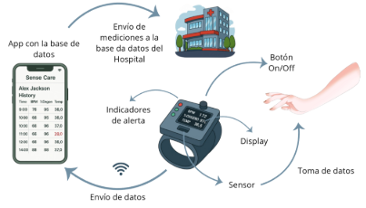
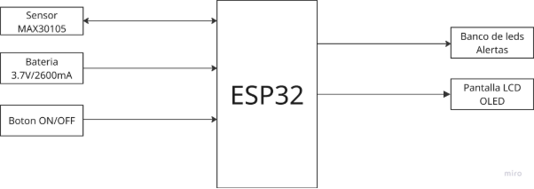
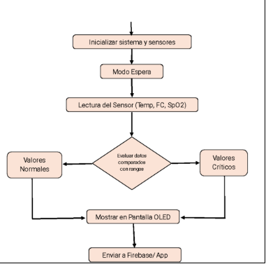
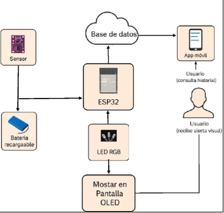

**DOCUMENTO DE DISEÑO**

**SenseCare: Tecnología Inteligente para Cuidar tu Salud**

**1. Introducción:**

El proyecto propone el desarrollo de un brazalete inteligente para monitoreo de signos vitales, diseñado para ser accesible, compacto y fácil de usar. Este dispositivo permite medir en tiempo real la temperatura corporal, frecuencia cardíaca y saturación de oxígeno, mostrando los datos en una pantalla incorporada y enviándolos a una base de datos para su consulta a través de una aplicación móvil. Además, integra alertas visuales para notificar al usuario en caso de valores fuera de los rangos normales. Con un enfoque en la prevención y el acompañamiento médico remoto, el brazalete está orientado a mejorar el cuidado de la salud en personas con enfermedades cardiovasculares, respiratorias, así como en adultos mayores y deportistas que requieren un control constante de sus signos vitales. El sistema embebido con ESP32 y la conectividad WiFi facilitan el registro y seguimiento histórico de datos, favoreciendo una intervención temprana ante posibles complicaciones.

**Objetivos del proyecto:**

- Monitorear en tiempo real los principales signos vitales de manera no invasiva.
- Alertar al usuario inmediatamente en caso de detectar valores anormales.
- Registrar y almacenar datos en una base de datos accesible para usuarios y profesionales de salud.
- Facilitar el acceso remoto a la información mediante una aplicación móvil intuitiva.
- Ofrecer un dispositivo compacto y asequible, con alta autonomía y donde los elementos electrónicos se encuentren en un compartimento aislado que proteja los componentes en su uso diario.

**2. Alcance y Limitaciones:**

**Alcance:** El proyecto abarca el desarrollo de un brazalete inteligente capaz de medir según un periodo de tiempo predefinido la temperatura corporal, la frecuencia cardíaca y la saturación de oxígeno, mostrando la información en una pantalla integrada y enviándola a una aplicación móvil que permite consultar el historial de datos. Además, incluye alertas visuales mediante LEDs para notificar al usuario cuando los valores están fuera de los rangos normales. Está diseñado para un uso diario cómodo y seguro, con protección contra salpicaduras y polvo (IP54), batería de larga duración y un enfoque accesible para facilitar el monitoreo preventivo de la salud.

**Limitaciones:** Las limitaciones del proyecto incluyen que el brazalete solo mide tres parámetros básicos y no reemplaza una evaluación médica completa, por lo que sirve como apoyo preventivo y no como diagnóstico definitivo. Por otro lado, aunque se estima una alta autonomía, la duración real de la batería puede reducirse con un uso intensivo de la pantalla y la conexión inalámbrica. Finalmente, la aplicación móvil podría presentar limitaciones iniciales de compatibilidad con algunos dispositivos o sistemas operativos.

**3. Diagrama de Contexto:**

**4. Diagrama de Bloques:**

**5. Diagrama de Software:                                                                              6. Diseño de Interfaces:**

**7. Alternativas de Diseño:**

- La idea principal fue diseñar un brazalete, donde inicialmente se planeaba colocar el sensor en el antebrazo. Sin embargo, se identificó que esa ubicación generaría demasiada fricción y resultaría incómoda para el usuario durante actividades diarias. Por ello, se decidió ubicarlo en una posición similar a un reloj, lo que mejora la ergonomía y permite que la pantalla quede visible en la parte superior, facilitando la lectura rápida de los datos y el acceso a las alertas.
- Se analizaron opciones como Arduino UNO, ESP8266 y ESP32, eligiéndose finalmente el ESP32. Esta elección se basó en su mayor potencia de procesamiento, conectividad WiFi-integrada y compatibilidad con múltiples protocolos de comunicación como I2C y UART, lo que facilita la integración de sensores y módulos adicionales. Además, el ESP32 es más compacto y energéticamente eficiente en comparación con el Arduino UNO, características clave para un dispositivo portátil y de uso continuo.
- Se valoraron módulos individuales para cada parámetro (termistores, pulsómetros ópticos, oxímetros independientes) y el sensor combinado MAX30105, el cual fue seleccionado. Este módulo permite medir frecuencia cardíaca, saturación de oxígeno y temperatura en un solo componente, reduciendo el número de conexiones, simplificando el diseño y minimizando el consumo energético.
- Se consideraron una pantalla LCD 16x2, una pantalla TFT a color y una pantalla OLED I2C, seleccionándose esta última. La pantalla OLED ofrece bajo consumo, tamaño reducido y excelente visibilidad en diferentes condiciones de luz. Su conexión mediante I2C permite una integración sencilla con el ESP32, y su capacidad para mostrar texto e íconos facilita una lectura clara y rápida.
- Las alternativas incluyeron comunicación Bluetooth, almacenamiento local en memoria SD y WiFi con base de datos (Firebase) y aplicación móvil. Se decidió implementar WiFi con Firebase para permitir la consulta remota de los datos desde la aplicación móvil en cualquier lugar, fomentando el monitoreo médico a distancia y la escalabilidad del sistema. Bluetooth se descartó por su alcance limitado, y la memoria SD local no ofrecía la interacción en tiempo real que se busca con SenseCare.
- Al principio, se pensó en usar un LED rojo y uno verde para indicar estado normal o crítico. Sin embargo, se decidió implementar LEDs RGB para ofrecer más flexibilidad y poder representar diferentes estados de alerta (por ejemplo, verde: normal, amarillo: precaución, rojo: crítico). Se escogió un LED RGB de ánodo común, ya que solo requiere una resistencia global, simplificando el circuito y reduciendo el espacio y el número de componentes.
- Se evaluó el uso de un modo de suspensión (*sleep mode*) del ESP32 para extender la autonomía de la batería. Esta función fue implementada, permitiendo que el dispositivo entre en reposo durante los periodos de inactividad y se reactive únicamente para realizar las mediciones y enviar los datos, optimizando así la eficiencia energética sin comprometer la funcionalidad.

**8. Plan de Test y Validación:**

|**Fase**|**Actividad**||
| :-: | :-: | :- |
||**Etapa 1**|**Etapa 2**|
|**Funcionamiento general**|Probar el sensor |Verificar la visualización correcta en la pantalla del brazalete.|
|**Precisión y calibración**|Calibrar sensores en laboratorio.|Revisar repetibilidad en diferentes usuarios y condiciones.|
|**Conectividad**|Comprobar envío de datos a la base de datos y app móvil.|Validar sincronización y actualización del historial.|
|**Alertas**|Simular valores fuera de rango y verificar la activación de LEDs.|Revisar visibilidad y claridad de las alertas.|
|` `**Autonomía y batería**|Probar duración real en uso continuo y en periodos determinados, con carga completa.|Medir consumo con pantalla y WiFi activos.|
|**Usabilidad**|Realizar pruebas con usuarios reales y recoger comentarios.|Ajustar interfaz y confort según feedback.|

**9. Consideraciones éticas:**

- Proteger la privacidad y confidencialidad de los datos del usuario.
- Obtener consentimiento informado antes de usar y recopilar información.
- Garantizar comodidad y seguridad física durante el uso.
- Comunicar claramente las capacidades y limitaciones del brazalete.
- Cumplir con normativas de dispositivos médicos y protección de datos.
- Evitar sustituir el diagnóstico médico profesional.
